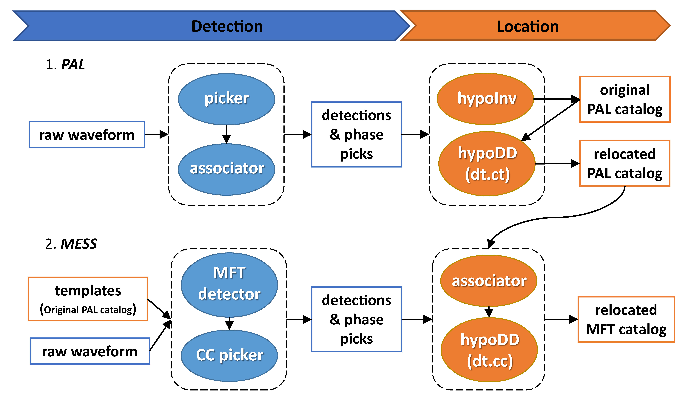

# MESS
MESS is a matched filter earthquake detector   
  
- **MESS Workflow**
1. **M**atch: calculate CC trace on every station (matched filter)
2. **E**xpand: expand peak values on CC traces
3. **S**hift: time shift to origin times for all CC traces  
4. **S**tack: stack CC traces of different stations & detect events on the stacked trace  
5. *dt_p* and *dt_s* are picked by cross-correlation  

- **Usage** (see *example_mess_workdir*)
1. Prepare template phase file (e.g. run [PAL](https://github.com/YijianZhou/PAL)) & cut template waveform 
2. Run MESS 

## Installation  
MESS is a set of codes. All you need is to setup proper Python environment. This can be accomplished easily by installing [Anaconda](https://www.anaconda.com/products/individual#Downloads), [Obspy](https://github.com/obspy/obspy/wiki/Installation-via-Anaconda), and [Pytorch](https://pytorch.org/) sequentially. Or you can use the *env/mess.yml* file with *conda*. 

## References

- **Zhou, Y.**, H. Yue, S. Zhou, L. Fang, Y. Zhou, L. Xu, Z. Liu, T. Wang, L. Zhao, & A. Ghosh (2022). Microseismicity along Xiaojiang Fault Zone (Southeastern Tibetan Plateau) and the Characterization of Interseismic Fault Behavior. *Tectonophysics*; 833: 229364. doi: [10.1016/j.tecto.2022.229364](https://doi.org/10.1016/j.tecto.2022.229364)  

- **Zhou, Y.**, H. Yue, L. Fang, S. Zhou, L. Zhao, & A. Ghosh (2021). An Earthquake Detection and Location Architecture for Continuous Seismograms: Phase Picking, Association, Location, and Matched Filter (PALM). *Seismological Research Letters*; 93(1): 413–425. doi: [10.1785/0220210111](https://doi.org/10.1785/0220210111)  

- **Zhou, Y.**, A. Ghosh, L. Fang, H. Yue, S. Zhou, & Y. Su (2021). A High-Resolution Seismic Catalog for the 2021 MS6.4/Mw6.1 YangBi Earthquake Sequence, Yunnan, China: Application of AI picker and Matched Filter. *Earthquake Science*; 34(5): 390-398.doi: [10.29382/eqs-2021-0031](https://doi.org/10.29382/eqs-2021-0031)  

- Lu, W., **Y. Zhou**, Z. Zhao, H. Yue, & S. Zhou (2021). Aftershock sequence of the 2017 Mw 6.5 Jiuzhaigou, China earthquake monitored by an AsA network and its implication to fault structures and strength. *Geophysical Journal International*; 228(3): 1763-1779. doi: [10.1093/gji/ggab443](https://doi.org/10.1093/gji/ggab443)  
